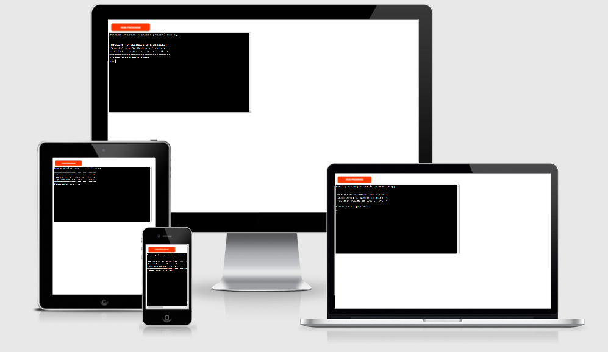

# ULTIMATE BATTLESHIP GAME
## Introduction

The live link can be found here - (https://battleshipp.herokuapp.com/)

Ultimate Battleship game is a two player game, which runs in python terminal and is deployed on heroku. 

In battleship game user play against computer and try to beat him by destroying the ships. whoever hit all the ships before the other player wins.

## Table of Contents

# Table of Contents

 [1. How to Play](#how-to-play)

 [2. Features](#features)

 [3. Technologies Used](#technologies-used)

 [4. Testing](#testing)

 [5. Bugs](#bugs)

 [6. Deployment](#deployment)

 [7. Credits](#credits)

# 1. How to Play
  [Go to top](#table-of-contents)

  Battleship game is multiplayer game, in which user play's against computer. After the welcome secreen user is asked to enter the X, Y co-ordinates. when user enter the co-ordinates these co-ordinates are checked by the validate method. if the co-ordinates are not valid it is prompt to enter valid co-ordinates again. if the co-ordinates are valid then checks if the input co-ordinates hit any ship. if it hits a ship place * if  not the place X. if all the ships are hit. whoever hit them before wins.

 
# 2. Features
  [Go to the top](#table-of-contents)

  - Stores individual score
  - Ships are placed randomly
  - The player cannot see oppnent's ships.
  - Accepts user input
  - validates inputs
   - you cannot enter co-ordinates outside grid
   - you must enter number
   - you cannot enter the same guess twice.

  
# 3. Technologies Used
  [Go to the top](#table-of-contents)

  ## Python
   - Python is used to develope the game.

  ## Lucid Chart
   - Lucid Chart was used to show the workflow of the game.

  ## Github
   - Github is used to store the project.